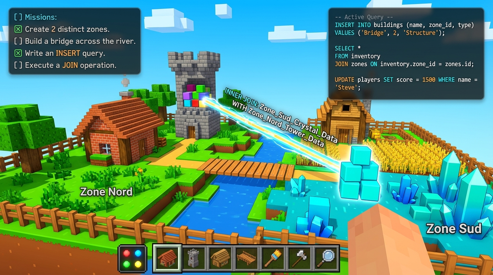
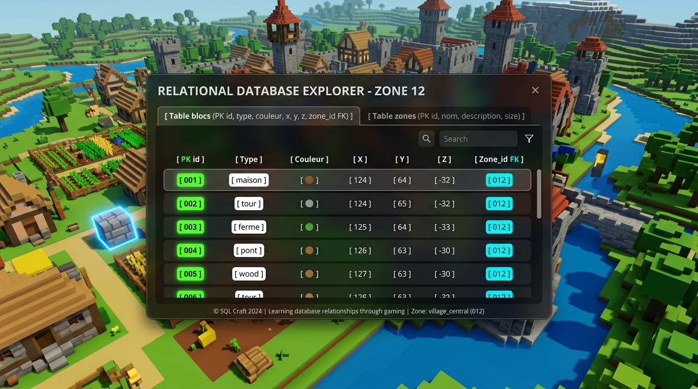

# 🎮 SQL Craft — Le Minecraft du BUT Science des Données

[](https://threejs.org/)
[](https://vitejs.dev/)
[](https://www.enseignementsup-recherche.gouv.fr/)
[](https://opensource.org/licenses/MIT)

> **Projet pédagogique — Module PPP (Projet Personnel et Professionnel)**  
> *Vulgarisation des bases de données et du langage SQL auprès des lycéens qui envisagent de rejoindre le BUT Science des Données.*



---

## 💡 Le Concept : "Comprendre en agissant"

En **BUT Science des Données**, la manipulation des données est au cœur de tous les métiers (Data Analyst, Data Engineer, Machine Learning Specialist). 

**SQL Craft** a été conçu pour faire découvrir le SQL aux lycéens sans aucun prérequis :
- **Zéro cours abstrait au départ** : Le joueur explore un monde en 3D inspiré de Minecraft.
- **Feedback instantané** : Chaque bloc posé, peint ou détruit exécute en direct la vraie requête SQL équivalente dans une console interactive.
- **Prise en main en moins d'une minute** : Contrôles FPS intuitifs (ZQSD/WASD, souris, hotbar 1 à 7).

---

## 🗺️ Le Monde 3D Voxel

- **Terrain borné (16x16 cases)** : Entouré de barrières et de tours de guet éclairées par des lanternes.
- **Zone Nord (`id: 1`)** : Plaine verdoyante avec herbe émeraude, pâquerettes et totem de la table `zones`.
- **Zone Sud (`id: 2`)** : Rivage cristallin aux nuances bleu azur avec cristaux de quartz.
- **Rivière centrale & Pontons** : Frontière naturelle matérialisant la séparation des zones.
- **Soleil directionnel & nuages cubiques** : Ambiance lumineuse et dynamique.

---

## 🛠️ Hotbar & Mapping SQL (Cœur Pédagogique)

Chaque action dans l'univers de jeu met immédiatement à jour une base de données relationnelle en mémoire (`blocs`) et affiche la requête correspondante :

| Touche | Outil en jeu | Action en jeu | Requête SQL exécutée en direct | Concept Pédagogique (CRUD) |
| :---: | :---: | :---: | :--- | :--- |
| **1** | 🏠 **Maison** | Clic pour poser | `INSERT INTO blocs (type, couleur, x, y, z, zone_id) VALUES ('maison', 'rouge', ...);` | **Create (INSERT)** : Ajout d'une ligne avec clé primaire (`id`). |
| **2** | 🗼 **Tour** | Clic pour poser | `INSERT INTO blocs (...) VALUES ('tour', ...);` | **Create (INSERT)** : Empilement en hauteur (`y`). |
| **3** | 🌾 **Ferme** | Clic pour poser | `INSERT INTO blocs (...) VALUES ('ferme', ...);` | **Create (INSERT)**. |
| **4** | 🌉 **Pont** | Clic pour poser | `INSERT INTO blocs (...) VALUES ('pont', ...);` | **Create (INSERT)** : Construction au-dessus de la rivière. |
| **5** | 🎨 **Pinceau** | Viser un bloc + clic | `UPDATE blocs SET couleur = 'bleu' WHERE id = 3;` | **Update (UPDATE)** : Modification ciblée par clé primaire. |
| **6** | 🪓 **Hache** | Viser un bloc + clic | `DELETE FROM blocs WHERE id = 2;` | **Delete (DELETE)** : Suppression de ligne avec explosion de débris. |
| **7** | 🔍 **Loupe** | Clic sur des blocs | `SELECT * FROM blocs WHERE id IN (1, 4);` | **Read (SELECT)** : Sélection avec halos lumineux et tags 3D. |
| **🔍 > 📋** | **Afficher** | Clic sur la toolbar | `SELECT * FROM blocs WHERE id IN (...);` | **Read (SELECT)** : Consultation des données brutes. |
| **🔍 > 🔍** | **Filtrer** | Menu déroulant | `SELECT * FROM blocs WHERE type = 'maison';` | Clause **WHERE** (filtre par type ou par couleur). |
| **🔍 > ↕️** | **Trier** | Menu déroulant | `SELECT * FROM blocs ORDER BY x ASC;` | Clause **ORDER BY** (badges numérotés 3D en jeu). |
| **🔍 > 🔢** | **Compter** | Bouton | `SELECT COUNT(*) FROM blocs;` | Fonction d'agrégation **COUNT()**. |
| **🔍 > 🔗** | **Relier** | Bouton | `SELECT blocs.id, zones.nom FROM blocs JOIN zones ON zones.id = blocs.zone_id;` | **Jointure relationnelle (JOIN)** : Faisceaux laser 3D reliant les blocs aux totems de zone et entre Nord et Sud ! |

---

## 🗄️ Explorateur de Base de Données (Touche T)

En appuyant sur **`T`** ou via le bouton **📊 Base de Données** dans l'en-tête, les élèves accèdent à un inspecteur visuel :



1. **Table `blocs`** : Visualisation des lignes avec badges explicites :
   - <span style="background:#16a34a;color:white;padding:2px 6px;border-radius:4px;font-size:12px;">PK</span> **`id`** : Clé primaire, identifiant unique de chaque ligne.
   - <span style="background:#0284c7;color:white;padding:2px 6px;border-radius:4px;font-size:12px;">FK</span> **`zone_id`** : Clé étrangère pointant vers la table `zones`.
   - *Cliquer sur une ligne de la table surligne instantanément le bloc correspondant dans le monde 3D !*
2. **Table `zones`** : Table de référence décrivant les deux régions du monde (Plaine Verdoyante / Rivage Cristallin).
3. **Vue Relationnelle (`JOIN`)** : Présentation du résultat fusionné sans duplication inutile de données.

---

## 🎯 Système de Missions & Diplôme BUT SD

Un panneau de quêtes guide le joueur à travers 5 missions progressives :
- [x] **Mission 1 : Le Bâtisseur (INSERT)** — Pose 3 blocs sur le terrain.
- [x] **Mission 2 : L'Artiste (UPDATE)** — Repeins un bloc avec le Pinceau (touche 5).
- [x] **Mission 3 : Le Démolisseur (DELETE)** — Détruis un bloc avec la Hache (touche 6).
- [x] **Mission 4 : L'Analyste (SELECT & COUNT)** — Sélectionne des blocs avec la Loupe (touche 7) et compte-les.
- [x] **Mission 5 : L'Architecte Données (JOIN)** — Pose au moins un bloc au Nord et un au Sud, puis clique sur **Relier** !

🎉 **Récompense finale** : Pluie de confettis, fanfare de victoire et affichage d'un diplôme d'initiation présentant les débouchés passionnants du **BUT Science des Données** (Big Data, Intelligence Artificielle, Python, Dataviz).

---

## 🕹️ Commandes du Joueur

| Touche / Action | Effet |
| :--- | :--- |
| **Z / Q / S / D** ou **W / A / S / D** | Déplacement du personnage |
| **Espace** | Sauter (sur le sol ou sur les blocs posés) |
| **Majuscule (Shift)** | Courir / Sprint |
| **Souris** | Orienter le regard (Pointer Lock) |
| **Clic Gauche** | Interagir avec le bloc visé par la croix |
| **1 à 7** / **Molette** | Changer d'outil dans la hotbar |
| **Touche C** | Changer la couleur active (Rouge, Bleu, Vert, Jaune) |
| **Touche T** | Ouvrir / fermer l'explorateur de base de données |
| **Échap** | Libérer le curseur de la souris |

---

## 💻 Stack Technique

- **Moteur 3D :** [Three.js](https://threejs.org/) (WebGL, ombres douces, brouillard d'horizon, animations procédurales).
- **Textures :** Générées dynamiquement par Canvas HTML5 (pixel-art rétro, zéro asset externe lourd, chargement instantané).
- **Moteur Audio :** [Web Audio API](https://developer.mozilla.org/fr/docs/Web/API/Web_Audio_API) (synthétiseur temps-réel sans fichier MP3 à charger).
- **Base de Données Client :** Moteur relationnel in-memory avec émission d'événements SQL.
- **Interface & HUD :** HTML5 / CSS3 Vanilla avec Glassmorphism et polices Outfit / Fira Code.
- **Build & Dev Server :** [Vite](https://vitejs.dev/).

---

## 🚀 Installation & Démarrage Local

Prérequis : [Node.js](https://nodejs.org/) (v18 ou supérieur recommandé).

```bash
# 1. Cloner le dépôt
git clone https://github.com/samyhouchat/SqlCraftGameplay.git
cd SqlCraftGameplay

# 2. Installer les dépendances
npm install

# 3. Lancer le serveur de développement
npm run dev
```

L'application s'ouvre automatiquement sur `http://localhost:5173/` !

Pour générer la version de production optimisée :
```bash
npm run build
```

---

## 🎓 À Propos du BUT Science des Données
Le **Bachelor Universitaire de Technologie en Science des Données** (anciennement STID) forme des spécialistes capables de :
- Collecter, nettoyer et structurer les données massives (**Big Data & SQL/NoSQL**).
- Programmer des algorithmes d'analyse et d'**Intelligence Artificielle** (**Python, R**).
- Créer des visualisations interactives pour éclairer les prises de décision (**Dataviz & BI**).
